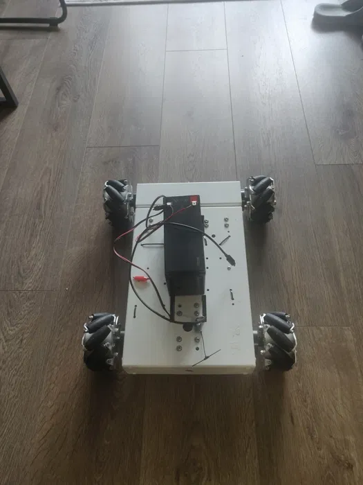

# ELRS-ESP32-C3-Omni4WD-car
[](https://www.arduino.cc/)
[](https://www.espressif.com/)
[](https://www.espressif.com/en/products/modules/esp32)
[](https://www.espressif.com/en/products/software/esp-now/overview)


A robust ESP32-C3 based RC (Remote Control) car controller project that uses ELRS (ExpressLRS) protocol for radio control. The project is built using PlatformIO and Arduino framework.

## Hardware
- Board: Adafruit QT Py ESP32-C3
- Radio: ELRS 2.4GHz receiver
- Motors: 4 DC motors (4-wheel drive configuration)

## Features
- 4-wheel independent motor control
- Smooth acceleration and direction control
- Advanced directional control with proportional steering
- Emergency stop functionality
- Real-time serial monitoring (115200 baud)
- PWM motor control with 10-bit resolution (0-1023)

## Motor Configuration
- 4 independent motor channels
- Each motor has:
  - PWM speed control pin
  - Two direction control pins (H-bridge configuration)
- PWM Frequency: 50Hz
- Adjustable motor speed range (MIN_PWM: 300, MAX_PWM: 2048)

## Control System
- Uses AlfredoCRSF library for ELRS protocol communication
- Implements:
  - Forward/Backward control
  - Left/Right steering
  - Variable speed control (0-100%)
  - Proportional turning with trigonometric calculations
  - Emergency stop on channel 5

## Pin Configuration
```
Left Front Motor (Motor 1):  Enable: 4,  Dir1: 5,  Dir2: 6
Right Front Motor (Motor 2): Enable: 3,  Dir1: 7,  Dir2: 8
Left Back Motor (Motor 3):   Enable: 2,  Dir1: 9,  Dir2: 10
Right Back Motor (Motor 4):  Enable: 1,  Dir1: 0,  Dir2: 21
ELRS Receiver: RX: 20, TX: 11 (empty pin for code, not used on bord esp32-c3 super mini)
```

## Dependencies
- AlfredoCRSF library
- ESP32 Arduino core (platform-espressif32)

## Safety Features
- Emergency stop function
- Motor safety checks
- Fail-safe motor state handling

This project demonstrates advanced motor control techniques with precise PWM management and sophisticated directional control algorithms, making it suitable for custom RC vehicle applications requiring precise movement control.

### I used
https://github.com/Iloke-Alusala/ELRS-ESP32-Channel-Decoder
https://github.com/RawFish69/ESP32-RC-Car


### Omni-Drive Version



